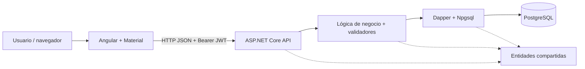
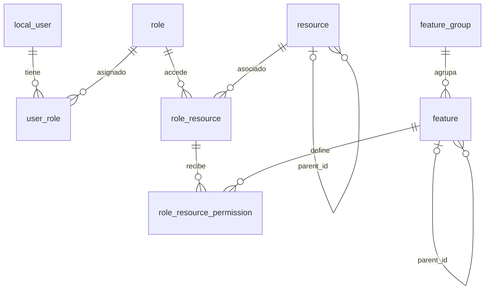

# Arquitectura y modelo de datos

[Volver al inicio](../README.md)

## Vista general

El sistema utiliza una arquitectura por capas en el backend y una aplicación Angular independiente en el navegador.



### Dependencias de proyectos

- `AAP_TUUA.API` referencia `AAP_TUUA.Business`.
- `AAP_TUUA.Business` referencia `AAP_TUUA.Dao` y `AAP_TUUA.Entidades`.
- `AAP_TUUA.Dao` referencia `AAP_TUUA.Entidades`.
- `AAP_TUUA.Entidades` define los objetos del dominio sin referencias a los otros proyectos.

Los controladores reciben `IConfiguration` y crean sus clases de negocio con la cadena de conexión. A su vez, las clases de negocio crean los DAO y validadores en sus constructores. No existe un registro general de interfaces para inyectar estas capas.

## Responsabilidades del backend

| Capa | Responsabilidad | Archivos representativos |
| --- | --- | --- |
| API | Rutas HTTP, lectura del token, códigos de respuesta y configuración del pipeline | `Controllers/`, `Filters/`, `Util/TokenUtil.cs`, `Program.cs` |
| Business | Validaciones, auditoría, autenticación y coordinación de operaciones | `LocalUserBL.cs`, `RoleBL.cs`, `AuthenticationBL.cs`, `Validators/` |
| Dao | Consultas SQL parametrizadas y mapeo de resultados | `LocalUserDao.cs`, `RoleDao.cs`, `ResourceDao.cs`, `FeatureDao.cs`, `AirlineDao.cs` |
| Entidades | Datos persistentes y propiedades de navegación | `LocalUser.cs`, `Role.cs`, `Resource.cs`, `Feature.cs`, `Airline.cs` |

Los DAO crean conexiones `NpgsqlConnection` dentro de bloques `using` y ejecutan SQL con Dapper. No hay un ORM con migraciones automáticas. Las operaciones compuestas, como actualizar roles de un usuario, se realizan mediante varias llamadas y no tienen una transacción global explícita.

## Pipeline HTTP

`AAP_TUUA.API/Program.cs` configura:

1. Controladores y generación del contrato OpenAPI.
2. CORS con la política `AllowAll`: cualquier origen, método y cabecera.
3. Autenticación JWT Bearer con validación de emisor, audiencia, firma y vigencia.
4. Servicios de autorización y registro de `AuthFilter` como `IAuthorizationFilter` scoped.

Después de construir la aplicación, registra OpenAPI solo en Development y aplica, en este orden, redirección HTTPS, CORS, autenticación, autorización y mapeo de controladores.

Los controladores administrativos utilizan el atributo `[AuthFilter]`. El registro scoped del filtro no lo convierte por sí solo en un filtro global. `AuthenticationController` utiliza `[AllowAnonymous]`.

## Autenticación y permisos

### Inicio de sesión

1. Angular envía `email` y `password` a `POST /api/Authentication/authenticate`.
2. `AuthenticationBL` busca el usuario por correo en `local_user`.
3. `Security.VerifyPassword` compara la contraseña contra el hash y el salt almacenados.
4. La API emite un JWT firmado con HMAC-SHA256, con identificador y correo del usuario, emisor, audiencia y una duración de ocho horas.
5. Angular guarda la respuesta en `localStorage`, con la clave `tuua.auth`.
6. `authInterceptor` añade `Authorization: Bearer <TOKEN>` a las solicitudes si existe un token almacenado.
7. `authGuard` revisa la presencia del token y su expiración para permitir el acceso al shell. `guestGuard` redirige al inicio cuando un usuario autenticado intenta entrar al login.

El logout elimina el almacenamiento local. No hay endpoints de renovación de tokens o revocación de sesión.

### Contraseñas

La implementación de `AAP_TUUA.Business/Util/Security.cs` utiliza PBKDF2 con SHA-1, 10 000 iteraciones, salt aleatorio de 16 bytes y un resultado de 32 bytes. Tanto hash como salt se almacenan en Base64. Estos parámetros describen el código ejecutable; los comentarios que mencionan SHA-256 no cambian el algoritmo utilizado.

Al crear usuarios se valida la coincidencia entre `password` y `confirm_password`, se genera el hash y se limpian esos dos campos transitorios. Al actualizar un usuario, una contraseña vacía conserva la existente.

### Validación del token

`TokenUtil` valida el JWT recibido y extrae el claim `unique_name`, donde se guarda el ID del usuario. Su tolerancia de expiración es cero; la validación configurada en el middleware JWT permite cinco minutos de `ClockSkew`.

`AuthFilter` comprueba la cabecera, valida el token y carga el usuario con roles y recursos. Implementa `IAuthorizationFilter` con un método `async void`; esa interfaz no permite al pipeline esperar de manera fiable sus consultas asíncronas. Este filtro no comprueba permisos específicos y tampoco rechaza explícitamente el caso de usuario inexistente después de la consulta.

### Modelo de permisos

- Un usuario puede tener varios roles mediante `user_role`.
- Cada rol puede tener varios recursos mediante `role_resource`.
- Cada asociación rol-recurso puede recibir varios permisos mediante `role_resource_permission`.
- Un permiso referencia un registro de `feature`.
- La pantalla de asignación busca el grupo cuyo nombre, normalizado, es `permisos`; si no existe, consulta el grupo con ID `1`.

`RequirePermissionAttribute` implementa `IAsyncAuthorizationFilter` y comprueba la coincidencia de `Resource.path` y `permission_name`. Puede responder `403` cuando falta la coincidencia y `401` cuando falla la resolución del token o del usuario. Actualmente no está aplicado a las acciones de los controladores existentes.

La implementación consulta PostgreSQL para cargar roles y recursos. Aunque hay comentarios y variables que mencionan claves de caché, no existe una integración activa con Redis.

## Frontend

Los componentes son standalone y las pantallas se cargan de forma diferida mediante `loadComponent` en `src/app/app.routes.ts`.

| Ruta | Componente | Función |
| --- | --- | --- |
| `/login` | `Login` | Autenticación con correo y contraseña. |
| `/` | `Shell` + `Home` | Estructura principal y bienvenida. |
| `/users` | `Users` | Usuarios y asignación de roles. |
| `/roles` | `Roles` | Administración de roles. |
| `/roles/:roleId/resources` | `AssignResources` | Recursos y permisos de un rol. |
| `/features` | `Features` | Grupos y elementos de catálogo. |
| `/resources` | `Resources` | Recursos de navegación. |
| `/airlines` | `Airlines` | Administración de aerolíneas. |

El shell usa `authGuard`; el login usa `guestGuard`. Las rutas desconocidas se redirigen a `/`. No hay guards de permisos por módulo.

### Estado, formularios y HTTP

- Los servicios de `src/app/services/` encapsulan `HttpClient` y devuelven `Observable`.
- Los modelos de `src/app/models/` representan los contratos de datos.
- Las pantallas utilizan formularios reactivos para validar entradas y signals para estado, errores, carga y selección.
- `app.config.ts` registra el router, el cliente HTTP, el interceptor, animaciones y listeners globales de errores del navegador.
- Los nombres persistentes se mantienen como `snake_case`; las propiedades de navegación serializadas incluyen `roles`, `resources`, `resource` y `permissionsList`.

### Menú dinámico

`Menu` consulta `Resource/GetAll`, conserva recursos cuyo `is_active` no sea `false` y construye un árbol usando `parent_id`. Ordena cada nivel por `weight` y después por nombre. El menú se adapta a pantallas de hasta 840 píxeles y permite colapsar el panel en escritorio.

El menú utiliza el listado general de recursos; no filtra por los roles del usuario. Registrar un recurso en la base de datos no crea automáticamente una ruta Angular: su `path` debe corresponder a una ruta implementada.

### Guardado de accesos de un rol

`AssignResources` compara la selección con el estado original y ejecuta las solicitudes en este orden:

1. Quitar permisos.
2. Quitar recursos.
3. Agregar recursos.
4. Agregar permisos.

La secuencia respeta la dependencia entre asociaciones. Las solicitudes son individuales; si una falla, las anteriores pueden haber quedado guardadas.

## Modelo de datos

El siguiente diagrama expresa las relaciones utilizadas por el código. No sustituye el DDL de PostgreSQL: las restricciones, índices y valores por defecto no están versionados en este repositorio.



`airline` es un catálogo independiente en el código actual.

### Tablas requeridas

| Tabla | Identificación utilizada | Datos principales |
| --- | --- | --- |
| `local_user` | `id` UUID | Nombre, correo, hash/salt, estados del usuario y campos de auditoría y recuperación. |
| `role` | `id` UUID | Nombre, actividad y auditoría. |
| `user_role` | `user_id` + `role_id` UUID | Asociación de usuarios con roles. |
| `resource` | `id` UUID | Nombre, descripción, tipo, ruta, método, padre, peso, icono y actividad. |
| `role_resource` | `role_id` + `resource_id` UUID | Asociación de roles con recursos y auditoría. |
| `role_resource_permission` | IDs de rol/recurso UUID + `permission_id` entero | Permisos asignados, actividad y auditoría. |
| `feature_group` | `id` entero | Nombre y descripción del grupo, auditoría. |
| `feature` | `id` entero | Descripción, abreviatura, valor, estado, padre y grupo. |
| `airline` | `id` UUID | Razón social, RUC, código SAP, códigos OACI/IATA y auditoría. |

`LocalUserDao`, `RoleDao` y `ResourceDao` generan los UUID de las nuevas entidades respectivas. `FeatureDao` espera IDs enteros generados por la base y los obtiene con `RETURNING id`. `AirlineDao` también usa `RETURNING id`, pero no envía un UUID al insertar: la base debe generar ese valor.

### Vistas requeridas

| Vista | Consumo |
| --- | --- |
| `view_resource_expanded` | Listado y consulta individual de recursos; mapea los campos de `Resource`, incluido `parent_description`. |
| `view_role_resource_permission_expanded` | Consulta de permisos y construcción de los recursos de cada rol; mapea IDs, estados, auditoría y nombres de permiso, recurso y rol. |

La versión de PostgreSQL, el DDL y los filtros internos de estas vistas no se especifican en el repositorio. No se puede asumir que una vista excluya asociaciones inactivas sin revisar su definición real.

### Campos de auditoría y estados

- Usuarios, roles y recursos utilizan `created_at` / `modified_at`.
- Aerolíneas y permisos rol-recurso utilizan `created_at` / `updated_at`.
- Features y grupos utilizan `created_date` / `modified_date`.
- Las clases de negocio suelen completar el usuario creador/modificador con el ID obtenido del JWT.
- La asignación directa de permisos recibe los campos `created_by` y `modified_by` del cuerpo; la pantalla actual los envía como `null`.
- El DAO de `user_role` inserta IDs y fechas, aunque la entidad también contiene campos de usuario creador/modificador.

## Reglas de negocio y comportamiento actual

| Operación | Comportamiento |
| --- | --- |
| Crear usuario | Nombre y correo válidos, contraseña y confirmación coincidentes; rechaza un correo ya registrado. Crea el usuario activo y no verificado. |
| Actualizar usuario | Modifica nombre/correo y opcionalmente contraseña. Si recibe `roles`, sincroniza asignaciones; `roles: []` las elimina y `roles: null` las conserva. |
| Eliminar usuario | Baja lógica con `is_deleted=true` e `is_active=false`. La pantalla oculta usuarios eliminados. |
| Crear o editar rol | Exige nombre. Eliminar establece `is_active=false`. |
| Crear recurso | Exige nombre, ruta y tipo. La interfaz ofrece tipos `GROUP` y `UI`. |
| Editar recurso | La lógica copia nombre, descripción, ruta, método, icono y actividad; conserva el tipo, peso y padre anteriores aunque lleguen valores nuevos. |
| Eliminar recurso | La interfaz llama a Update con `is_active=false`. |
| Crear o editar grupo | Exige nombre. |
| Crear o editar feature | Exige descripción y valor; el objeto incluye estado, grupo y padre opcional. La baja se realiza con Update e `is_active=false`. |
| Crear o editar aerolínea | Razón social obligatoria, máximo 100 caracteres; RUC hasta 30, SAP hasta 100 y OACI/IATA hasta 5. La creación fuerza el estado activo. |
| Eliminar aerolínea | Baja lógica con `is_active=false`. |

Las consultas generales de usuarios, roles y aerolíneas no excluyen estados inactivos. El login busca por correo y verifica la contraseña sin comprobar `is_active`, `is_deleted` o `is_verified`. Los campos de recuperación/verificación de usuarios existen en la entidad, pero no hay un flujo HTTP que los gestione. `last_login_at` tampoco se actualiza en el inicio de sesión actual.

## Recorrido de una operación

Ejemplo: crear una aerolínea.

```text
airlines.ts (formulario y validación)
  → airline.service.ts (POST /api/Airline/Add)
  → AirlineController.Add (token y respuesta HTTP)
  → AirlineBL.Add (FluentValidation, auditoría y estado)
  → AirlineDao.Add (INSERT ... RETURNING id)
  → PostgreSQL
```

Para agregar una funcionalidad siguiendo la estructura existente:

1. Define la entidad C# y el modelo TypeScript.
2. Prepara los cambios de esquema PostgreSQL necesarios y sus scripts versionados.
3. Implementa consultas parametrizadas en el DAO.
4. Incorpora reglas y coordinación en Business.
5. Expón la operación en un controlador y define su autenticación/autorización.
6. Añade el servicio, componente y ruta Angular.
7. Registra el recurso y los permisos si corresponde y actualiza la referencia de API.
